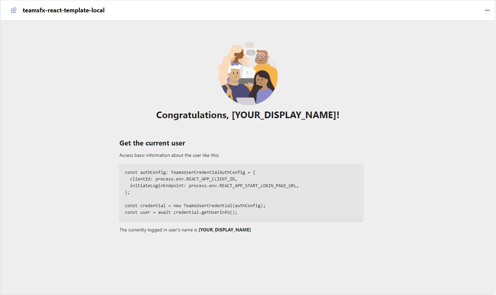

# Overview of the Teamsfx React template

This template showcases how to craft a visually appealing web page that can be embedded in Microsoft Teams, Outlook and the Microsoft 365 app with React and Fluent UI. The app also enhances the end-user experiences with built-in single sign-on (SSO).

## Table of contents

- [Get started with the Teamsfx React template](#get-started-with-the-teamsfx-react-template)
- [What's included in the Teamsfx React template](#whats-included-in-the-teamsfx-react-template)
- [Customize the Teamsfx React template](#customize-the-teamsfx-react-template)
- [Customize Microsoft Entra applications](#customize-microsoft-entra-applications)
- [Extend the Teamsfx React template](#extend-the-teamsfx-react-template)

## Get started with the Teamsfx React template

> **Prerequisites**
>
> To run the template in your local dev machine, you will need:
>
> - [Node.js](https://nodejs.org/), supported versions: 16, 18
> - A [Microsoft 365 account for development](https://docs.microsoft.com/microsoftteams/platform/toolkit/accounts)
> - [Set up your dev environment for extending Teams apps across Microsoft 365](https://aka.ms/teamsfx-m365-apps-prerequisites)
>   Please note that after you enrolled your developer tenant in Office 365 Target Release, it may take couple days for the enrollment to take effect.
> - [Teams Toolkit Visual Studio Code Extension](https://aka.ms/teams-toolkit) version 5.0.0 and higher or [Teams Toolkit CLI](https://aka.ms/teamsfx-toolkit-cli)

1. First, select the Teams Toolkit icon on the left in the VS Code toolbar.
2. In the Account section, sign in with your [Microsoft 365 account](https://docs.microsoft.com/microsoftteams/platform/toolkit/accounts) if you haven't already.
3. Press F5 to start debugging which launches your app in Teams using a web browser. Select `Debug in Teams (Edge)` or `Debug in Teams (Chrome)`.
4. When Teams launches in the browser, select the Add button in the dialog to install your app to Teams.

**Congratulations**! You are running an application that can now show a basic web page in Teams, Outlook and the Microsoft 365 app.



## What's included in the Teamsfx React template

| Folder       | Contents                                                                         |
| ------------ | -------------------------------------------------------------------------------- |
| `.vscode`    | VSCode files for debugging.                                                      |
| `appPackage` | Templates for the Teams application manifest.                                    |
| `env`        | Environment files.                                                               |
| `infra`      | Templates for provisioning Azure resources.                                      |
| `src`        | The source code for the Teams application. Implemented with Fluent UI Framework. |

The following are Teams Toolkit specific project files. You can [visit a complete guide on Github](https://github.com/OfficeDev/TeamsFx/wiki/Teams-Toolkit-Visual-Studio-Code-v5-Guide#overview) to understand how Teams Toolkit works.

| File                 | Contents                                                                                                                                                                                                                                                |
| -------------------- | ------------------------------------------------------------------------------------------------------------------------------------------------------------------------------------------------------------------------------------------------------- |
| `teamsapp.yml`       | This is the main Teams Toolkit project file. The project file defines two primary things: Properties and configuration Stage definitions.                                                                                                               |
| `teamsapp.local.yml` | This overrides `teamsapp.yml` with actions that enable local execution and debugging.                                                                                                                                                                   |
| `aad.manifest.json`  | This file defines the configuration of Microsoft Entra app. This template will only provision [single tenant](https://learn.microsoft.com/azure/active-directory/develop/single-and-multi-tenant-apps#who-can-sign-in-to-your-app) Microsoft Entra app. |

## Customize the Teamsfx React template

You can customize the Teamsfx React template by following the steps below:

1. Go to `appPackage/manifest.json` file:

   - Update the `name` fields to change the name of your Teams app.

   ```json
    "name": {
      "short": "YOUR_SHORT_APP_NAME",
      "full": "YOUR_FULL_APP_NAME"
    },
   ```

   - Update the `description` fields to change the description of your Teams app.

   ```json
    "description": {
      "short": "YOUR_APP_SHORT_DESCRIPTION",
      "full": "YOUR_APP_FULL_DESCRIPTION"
    },
   ```

   - Update the `developer` fields to change the developer of your Teams app.

   ```json
    "developer": {
      "name": "YOUR_NAME",
      "websiteUrl": "YOUR_WEBSITE_URL",
    },
   ```

2. Go to `aad.manifest.json` file:

   - Update the `name` field to change the name of your Microsoft Entra app used for SSO.

   ```json
    "name": "YOUR_AAD_APP_NAME",
   ```

3. Go to`teamsapp.yml` file:

   - Under `provision`:

     - Update the `name` field in `aadApp/create` to change the name of the Azure app registration.

     ```yaml
     provision:
       - uses: aadApp/create
         with:
           name: "YOUR_AAD_APP_NAME"
     ```

     - Update the `name` field in `teamsApp/create` to change the name of the Teams app.

     ```yaml
     provision:
       - uses: teamsApp/create
         with:
           name: "YOUR_TEAMS_APP_NAME"
     ```

4. Go to `teamsapp.local.yml` file:

   - Under `provision`:

     - Update the `name` field in `aadApp/create` to change the name of the Azure app registration.

     ```yaml
     provision:
       - uses: aadApp/create
         with:
           name: "YOUR_AAD_APP_NAME"
     ```

     - Update the `name` field in `teamsApp/create` to change the name of the Teams app.

     ```yaml
     provision:
       - uses: teamsApp/create
         with:
           name: "YOUR_TEAMS_APP_NAME"
     ```

5. You can debug your application by pressing F5. Teams Toolkit will use the Microsoft Entra manifest file to register a Microsoft Entra application registered for SSO. To learn more about Teams Toolkit local debug functionalities, refer to this [document](https://docs.microsoft.com/microsoftteams/platform/toolkit/debug-local).

## Customize Microsoft Entra applications

The Microsoft Entra [manifest](https://docs.microsoft.com/azure/active-directory/develop/reference-app-manifest) allows you to customize various aspects of your application registration. You can update the manifest as needed.

Follow this [document](https://aka.ms/teamsfx-aad-manifest#how-to-customize-the-Microsoft-Entra-manifest-template) if you need to include additional API permissions to access your desired APIs.

Follow this [document](https://aka.ms/teamsfx-aad-manifest#How-to-view-the-Microsoft-Entra-app-on-the-Azure-portal) to view your Microsoft Entra application in Azure Portal.

## Extend the Teamsfx React template

Following documentation will help you to extend the Teamsfx React template.

- [Add or manage the environment](https://learn.microsoft.com/microsoftteams/platform/toolkit/teamsfx-multi-env)
- [Create multi-capability app](https://learn.microsoft.com/microsoftteams/platform/toolkit/add-capability)
- [Use an existing Microsoft Entra application](https://learn.microsoft.com/microsoftteams/platform/toolkit/use-existing-aad-app)
- [Customize the Teams app manifest](https://learn.microsoft.com/microsoftteams/platform/toolkit/teamsfx-preview-and-customize-app-manifest)
- Host your app in Azure by [provision cloud resources](https://learn.microsoft.com/microsoftteams/platform/toolkit/provision) and [deploy the code to cloud](https://learn.microsoft.com/microsoftteams/platform/toolkit/deploy)
- [Collaborate on app development](https://learn.microsoft.com/microsoftteams/platform/toolkit/teamsfx-collaboration)
- [Set up the CI/CD pipeline](https://learn.microsoft.com/microsoftteams/platform/toolkit/use-cicd-template)
- [Publish the app to your organization or the Microsoft Teams app store](https://learn.microsoft.com/microsoftteams/platform/toolkit/publish)
- [Enable the app for multi-tenant](https://github.com/OfficeDev/TeamsFx/wiki/Multi-tenancy-Support-for-Azure-AD-app)
- [Preview the app on mobile clients](https://aka.ms/teamsfx-mobile)
